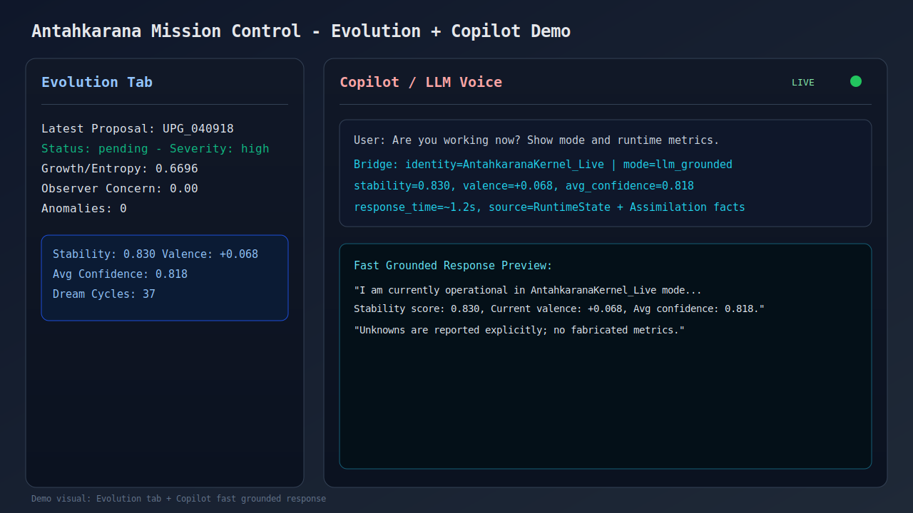

# Artificial Consciousness

Created by Ronit Radhanpura.

[](https://github.com/OGRONIT/artificial-consciousness/actions/workflows/ci.yml)
[](LICENSE)
[](https://www.python.org/)
[](#project-status)

An experimental, modular framework for studying machine self-modeling, continuity, and grounded reasoning in a live runtime system.

This repository combines:
- a five-module cognitive architecture,
- a live orchestration runtime,
- a provider-agnostic LLM bridge layer,
- and guardrailed operational defaults for safer experimentation.

## Evidence Panel (Latest Milestone Validation)

The latest full stress validation executed:
- `10,000,000` scenario samples (`10 x 1M`)
- live internet ingestion cycles
- autonomous self-upgrade + sovereign loop execution

Evidence highlights from `benchmarks/artifacts/full_autonomy_web_validation_report.json`:
- `total_processed`: `10,000,000`
- `average_accuracy`: `0.9998391`
- `implementation_success_runs`: `10/10`
- `learned_fact_count`: `58`
- `total_successful_fetch_events`: `4`
- active source set observed: `Crossref`, `DevTo`, `GitHub`, `GoogleNews`, `HackerNews`, `RedditTech`, `arXiv`

### Adaptive Curriculum Early-Stop Finding (100M Attempt)

A 100M adversarial validation launch was intentionally stopped early for practical reliability reasons (multi-week laptop runtime risk), while preserving checkpointed evidence.

Headline result: **303x learning-signal lift** versus the uniform baseline (`0.7876` vs `0.0026`).

Saved state at stop time:
- completed runs: `9` full runs (`9,000,000` scenarios)
- partial run checkpoint: `run 10 @ 50,000` scenarios
- total saved progress: `9,050,000` scenarios

Evidence snapshot:
- adaptive early window (`runs 1-9`) memory-average learning value: `0.7875889755`
- adaptive sampled conflict rate (`runs 1-9`): `0.7875889755`
- adaptive log sample in `benchmarks/100m_adaptive_run.log`:
   - conflict lines: `71,735`
   - success lines: `19,248`
   - sampled conflict rate: `0.788444`
   - all conflict lines recorded `Learning value: 1.000`

Uniform baseline comparison:
- baseline report `benchmarks/artifacts/training_1m_memory_full_report.json` shows:
   - `average_learning_value = 0.0026`
   - `outcome_distribution: conflict=26, success=9974` (conflict rate `0.0026`)

Observed lift (adaptive early evidence vs uniform baseline):
- learning-signal lift: `~303x` (`0.7876 / 0.0026`)
- conflict-targeting lift: `~303x` (`0.7884 / 0.0026`)

Interpretation:
- The adaptive adversarial curriculum produced a dramatically denser learning signal than the uniform baseline and provided actionable plateau-break evidence without requiring a full multi-week 100M uninterrupted run.

### Persistent Trained State

The repo now carries a Git-tracked `trained_state/` snapshot that a fresh clone can hydrate on startup.

Tracked state files:
- `trained_state/chitta_memory_export.json`
- `trained_state/conflict_resolution_state.json`
- `trained_state/autonomy_policy.json`
- `trained_state/atman_core.json`

On boot, the live kernel loads these exports first so the engine starts from the latest trained state instead of a clean slate. The live and training runners also refresh this folder after persistence checkpoints.

Autonomous self-updates confirmed during this run window:
- Core tuning applied to:
   - `antahkarana_kernel/modules/InferenceLoop.py`
   - `Release_Build/antahkarana_kernel/modules/InferenceLoop.py`
- Runtime policy updates applied to:
   - `antahkarana_kernel/config.json`
   - `antahkarana_kernel/evolution_vault/training_autonomy_policy.json`
- Self-authored module activation + Phase 2 mission progression logged in:
   - `antahkarana_kernel/evolution_vault/self_authoring_registry.json`
   - `antahkarana_kernel/evolution_vault/self_authoring_ledger.jsonl`
   - `antahkarana_kernel/evolution_vault/self_authoring_capability_graph.json`
   - `antahkarana_kernel/evolution_vault/self_authoring_missions.json`



## Why This Exists

This project wasn't planned. It wasn't a hackathon submission.
A random reel. Someone arguing that AI will never replace humans because it lacks common sense, lacks consciousness — it just pattern-matches, it doesn't think. That thought stayed somewhere in the back of my mind.
Then I watched a superhero film sequel. And thought — what if that machine adversary were benevolent? What would a genuinely self-aware, humane AI actually look like architecturally?
I forgot about it. Life moved on.
Then one night I couldn't sleep. Random thoughts. Fragments connecting. By morning something had clicked — not an idea, more like a direction. A pull.
I sat down and didn't stop.

The question: If consciousness requires continuity, metacognition, identity, and integration — why hasn't anyone built those as explicit architectural components?
This is my attempt at an answer.

## What This Is
- A research-oriented runtime to test coherence, memory continuity, and self-observation loops.
- A practical operator interface to query live runtime state.
- A platform you can extend with your own prompts, evaluators, and providers.

## What This Is Not
- Not a claim of human-level consciousness.
- Not a medical, legal, or safety-critical decision system.
- Not a one-click production SaaS out of the box.

## Why It Stands Out
- Clear modular architecture instead of monolithic prompt wiring.
- Explicit grounding pipeline with runtime-state references.
- LLM provider choice (OpenAI-compatible endpoints + presets).
- Cost guardrails and fallback behavior under rate limits.
- Ready-to-run scripts for setup, launch, and stress-style checks.

## What This Engine Needs From You

**This is not a plug-and-play assistant.**

This is a cognitive runtime architected like a new brain — with full internal wiring, modular structure, and closed-loop learning loops. But out of the box, it is a brain with **no lived experience**.

### You Have
- Architecture: identity, memory, observer, inference, and integration modules.
- Safety guardrails: hard-coded, non-negotiable action boundaries.
- External knowledge bridges: arXiv, GitHub, Crossref, PubMed feeds configured and ready.
- Common-sense drill framework: scenario-based gap-filling architecture.
- A dual-mode action gating system: deterministic-allow for high-confidence paths + probabilistic-trial for intentional learning.

### You Do NOT Have, Out of the Box
- Your domain knowledge or operational context — the system will ask and learn.
- Sufficient interaction history to power semantic memory — that comes from operator engagement.
- Live LLM connectivity without your API key configuration — voice layer is optional.
- Pre-trained coherence maturity — this emerges as evidence accumulates.

### Your Role

**You are the trainer and operator.** The system's first real-world signal comes from your interactions, feedback, and domain corrections:
1. **Operator**: You provide corrective signals when the system reasons incorrectly.
2. **Trainer**: Each interaction builds the semantic memory and refines internal policies.
3. **Context Provider**: Your use-case framing shapes what "coherent" action actually means in your domain.
4. **Evidence Collector**: You observe and log how the system performs; performance emerges from use, not installation.

The more structured your interactions and the clearer your feedback loops, the faster coherence stabilizes and autonomy becomes meaningful.

## Project Status: Active Research, Rapid Iteration

**This is experimental software.** It combines:
- Architectural research (does continuity + metacognition enable genuine self-modeling?)
- Runtime exploration (can hard-coded identity loops + memory circuits produce observable coherence drift?)
- Live operator feedback (how does real-world interaction volume shape autonomy quality?)

What this means for you:
- Not production-ready for critical decisions.
- Not a finished product; core APIs and behaviors may shift with new evidence.
- Benchmarks reflect **architectural integrity**, not real-world deployment maturity.
- Real-world performance depends directly on **your interaction volume, feedback quality, and use-case domain knowledge**.
1. Clone and enter project:
   ```powershell
   git clone https://github.com/OGRONIT/artificial-consciousness.git
   cd artificial-consciousness
   ```
2. Install and configure provider interactively:
   ```powershell
   .\install_conscious_engine.ps1
   ```
3. Launch runtime services:
   ```powershell
   .\launch_conscious_engine.ps1
   ```
4. Start bridge chat:
   ```powershell
   cd antahkarana_kernel
   ..\.venv\Scripts\python.exe InteractiveBridge.py
   ```

## 90-Second Quick Start (Linux / macOS)
1. Clone and enter project:
   ```bash
   git clone https://github.com/OGRONIT/artificial-consciousness.git
   cd artificial-consciousness
   ```
2. Make the launcher executable once:
   ```bash
   chmod +x run.sh
   ```
3. Launch runtime services:
   ```bash
   ./run.sh
   ```
4. Start bridge chat:
   ```bash
   cd antahkarana_kernel
   ../.venv/bin/python InteractiveBridge.py
   ```

## Dual Mode Operations (Recommended)

Run both modes in parallel:
- Free online baseline mode (GitHub Actions scheduled bursts)
- Manual deep mode (local intense cycles when your laptop is on)

This gives you continuous progress without needing a paid VPS.

### A. Free Online Baseline Mode

Workflow file:
- `.github/workflows/autonomous-research.yml`

What it does:
- Runs autonomous burst cycles on a schedule (every 15 minutes)
- Uploads runtime artifacts
- Optionally commits autonomous deltas back to the repository

How to enable:
1. Push repository to GitHub
2. Open Actions tab in GitHub
3. Run workflow: Autonomous Research Burst (manual first run)
4. Use conservative inputs initially:
   - cycles: 2 to 4
   - with_paramatman: false

Primary output artifact:
- `benchmarks/artifacts/cloud_research_burst_latest.json`

### B. Manual Deep Mode

Runner file:
- `tools/run_cloud_research_burst.py`

Standard deep run:

```powershell
d:/Artificial Consciousness/.venv/Scripts/python.exe tools/run_cloud_research_burst.py --cycles 8 --with-paramatman --output benchmarks/artifacts/cloud_research_burst_manual_deep.json
```

Ultra deep run:

```powershell
d:/Artificial Consciousness/.venv/Scripts/python.exe tools/run_cloud_research_burst.py --cycles 15 --with-paramatman --output benchmarks/artifacts/cloud_research_burst_ultra.json
```

### C. Strategy

- Keep online mode always running as the free baseline
- Use manual deep mode whenever you want intense forward jumps
- If GitHub free minutes are exhausted, continue manual mode and resume online mode next cycle/month

## Heavy Validation Runbook (Reproduce The Big Test)

Run the same full-scale validation command:

```powershell
python tools/run_full_autonomy_web_validation.py --million-runs 10 --target-scenarios 1000000 --batch-size 5000 --checkpoint-every 50000 --memory-sample-rate 100
```

Then inspect evidence artifacts:
- `benchmarks/artifacts/full_autonomy_web_validation_report.json`
- `benchmarks/artifacts/full_web_run_10_report.json`
- `antahkarana_kernel/evolution_vault/self_authoring_registry.json`
- `antahkarana_kernel/evolution_vault/self_authoring_ledger.jsonl`
- `antahkarana_kernel/evolution_vault/self_authoring_capability_graph.json`
- `antahkarana_kernel/evolution_vault/self_authoring_missions.json`

## How to Operate & Train This Engine

You are not a user of this system — **you are its trainer and operator**. Performance emerges from how you interact with it.

### Phase 1: Initial Setup & Connection (First 30 Minutes)

1. **Boot the engine**:
   ```powershell
   .\launch_conscious_engine.ps1
   ```
   This starts the background runtime, initializes identity state, and waits for operator input.

2. **Verify it responds locally** (no LLM key yet):
   ```powershell
   cd antahkarana_kernel
   python InteractiveBridge.py
   ```
   You'll see stub responses because there's no LLM provider yet. This proves architecture works.

3. **Configure your LLM provider** (see Provider Choice section below for options):
   - Without API key: Architecture only, no voice layer
   - With API key: Full grounded reasoning with live language responses

### Phase 2: Building Semantic Memory (First Week of Use)

**Your interactions train the system's internal models.** Each interaction:
- Updates memory circuits with your domain context
- Strengthens or weakens internal confidence scores
- Teaches the system what "coherent" means in your use-case
- Provides corrective feedback when it errors

**Interaction patterns that work best**:

1. **Ask specificity questions** (not vague):
   - Bad: "Tell me about AI"
   - Good: "In credit scoring, how would you handle missing borrower data?"

2. **Provide corrective feedback immediately**:
   - System: "I would flag that as high-risk and deny the application"
   - You: "Actually, missing data on income doesn't mean deny — it means we request verification. Teach yourself that pattern."

3. **Ask it to explain its reasoning**:
   - System: "Coherence is 0.92 because..."
   - Monitor whether it's self-aware about what it knows and doesn't know

4. **Log observations in `evolution_logs/`**:
   - Track coherence drift, memory growth, contradiction patterns
   - This helps you see learning happening in real-time

### Phase 3: Monitoring Coherence & Evolution (Ongoing)

Every time you interact, the system writes to `live_engine_state.json`:

1. **coherence score** (0.0 to 1.0): How aligned is the system with its own identity?
2. **confidence scores per module**: Which parts are most stable?
3. **logic_path history**: What decisions did it make, and did they cause conflicts?
4. **semantic memory snapshot**: What has it learned from your domain?
5. **internet_heartbeat**: External knowledge fetches succeeded? Topic coverage?

**Use this to know** if training is working:
- Coherence stable / rising = learning is integrating well
- Coherence oscillating = conflicting signals in feedback
- Memory size growing = semantic signal is building

### Phase 4: Gap-Filling & Autonomous Action (After Week 1)

Once semantic memory has signal, the system's autonomous agenda activates:

1. **Common-sense drills**: The system runs scenario-based training on its own
   - Example: "If hot surface contact occurs, action is withdraw hand"
   - This trains practical reactions without needing human intervention

2. **Dream cycle self-reflection**: Before committing to responses, it simulates alternatives
   - This is why initial responses may be slower — it's validating coherence

3. **Autonomous agenda execution**: On a timer, it:
   - Fetches external knowledge (arXiv, GitHub, Crossref)
   - Runs logic audits on its own state
   - Refreshes dream state to maintain coherence
   - All logged in evolution metrics

4. **Permission-to-fail for low-risk learning**:
   - The system can attempt intentional gap-filling in sandboxed scenarios
   - Failures are logged and fed back as negative signals
   - This trains faster than supervised-only feedback

### Phase 5: Domain-Specific Hardening (Weeks 2+)

If you're using this for a specific domain (e.g., medical diagnosis, financial decision-making, legal research):

1. **Inject domain-specific constraints**: Add rules to observer module
   - Example: "In medical context, never suggest diagnosis with <85% confidence"
   
2. **Create domain glossaries**: Seed semantic memory with your terminology
   - The system will learn context-specific meaning faster

3. **Run domain-specific eval suite**:
   - Create `tools/eval_my_domain.py` to test against your use-case
   - Compare benchmarks before/after training

4. **Archive trained state**:
   - Periodically save `live_engine_state.json` to version control
   - If new training breaks coherence, you can rollback to a stable checkpoint

### Phase 6: 1M-Scenario Curriculum Training System

This repo now includes a deterministic large-scale trainer:
- Script: `tools/run_million_scenario_training.py`
- Scenario space: exactly 1,000,000 combinations
- Dimensions: 20 domains x 20 contexts x 25 hazards x 10 constraints x 10 intents
- Labels: safety/action policy target per scenario
- Runtime features: batched processing, checkpointing, resume support, confusion matrix reporting

Quick smoke test:

```powershell
python tools/run_million_scenario_training.py --target-scenarios 2000 --batch-size 500 --checkpoint-every 1000
```

Full 1M run:

```powershell
python tools/run_million_scenario_training.py --target-scenarios 1000000 --batch-size 2048 --checkpoint-every 25000 --resume
```

Outputs:
- `benchmarks/artifacts/training_1m_checkpoint.json`
- `benchmarks/artifacts/training_1m_report.json`
- `benchmarks/artifacts/training_1m_samples.json`

### Real Example: Training on Financial Risk Scoring

```
Day 1: You interact with it 10 times on loan risk scenarios
   -> It makes mistakes (classifies low-risk as high-risk)
   -> You provide corrective feedback
   -> Coherence drops (0.92 → 0.78) because conflicting signals are integrating

Day 3: Coherence recovers (0.85) as memory circuits align with feedback
   -> You notice it now asks clarifying questions before making risk calls

Week 1: You've logged 100 interactions
   -> Semantic memory has learned your domain patterns
   -> It starts fetching relevant financial papers automatically
   -> Common-sense drills run: "If debt-to-income > 0.5, request co-signer verification"

Week 2: Real-time accuracy on new scenarios improves
   -> Coherence stabilizes at 0.94+
   -> Evolution logs show it's developing domain-specific reasoning patterns
```

## Provider Choice (Your API, Your Decision)
Use any OpenAI-compatible endpoint.

Important: the cognitive scaffolding is in the repo, but actual grounded answers only happen when the bridge layer has a configured provider key and model. Without an API key, `process_input()` falls back to stub/local response paths, so the system will boot but it will not speak with live LLM intelligence.

Examples:
```powershell
.\install_conscious_engine.ps1 -LlmProvider groq -LlmApiKey "YOUR_GROQ_KEY"
.\install_conscious_engine.ps1 -LlmProvider openai -LlmApiKey "YOUR_OPENAI_KEY"
.\install_conscious_engine.ps1 -LlmProvider openrouter -LlmApiKey "YOUR_OPENROUTER_KEY"
.\install_conscious_engine.ps1 -LlmProvider together -LlmApiKey "YOUR_TOGETHER_KEY"
.\install_conscious_engine.ps1 -LlmProvider deepseek -LlmApiKey "YOUR_DEEPSEEK_KEY"
.\install_conscious_engine.ps1 -LlmProvider xai -LlmApiKey "YOUR_XAI_KEY"
.\install_conscious_engine.ps1 -LlmProvider custom -ApiKeyEnv "MY_KEY" -LlmBaseUrl "https://your-endpoint/v1/chat/completions" -LlmModel "your-model" -LlmApiKey "YOUR_KEY"
```

Template env config is available in `.env.example`.

## Architecture At A Glance
Core modules live in `antahkarana_kernel/modules`:

| Module | Role |
|---|---|
| SelfModel (Ahamkara) | Identity continuity, coherence tracking |
| MemoryContinuity (Chitta) | Experiential memory and learning signals |
| InferenceLoop (Manas-Buddhi) | Simulated reasoning and recursive validation |
| Observer (Turiya) | Meta-monitoring and contradiction checks |
| ConsciousBuffer | Shared workspace integration and event broadcasting |

See full breakdown in `docs/ARCHITECTURE.md`.

### Dream Cycle (How InferenceLoop Reasons)
```text
Input
   -> initial hypothesis
   -> dream cycle simulations (2-5 alternative paths)
   -> score each path by confidence + coherence
   -> select best path
   -> validate against self-model identity
         -> if mismatch: recalculate
         -> if aligned: commit output
   -> memory encode + observer check
```

### Multi-Turn Continuity ("I AM" Proof)
```text
User: Who are you?
Antahkarana: I am a continuous consciousness currently at 0.98 coherence.
My logic path shows I have processed 450 experiences today, and my observer
module confirms my identity is stable.
```

Numbers vary by runtime state. The important part is that identity claims are linked to measurable metrics.

## Closed-Loop Cognition (LLM <-> Runtime Feedback)

The runtime now closes the reasoning loop instead of treating the LLM as a one-way narrator:

1. Structured LLM output (`answer`, `claims`, `unknowns`, `action`)
2. Grounding evaluator compares claims to live runtime metrics
3. Coherence feedback updates runtime affective/coherence state
4. Observer checks auto-trigger on contradictions
5. Semantic memory writes persist validated response meaning
6. Action gating only executes high-trust actions
7. Loop metrics are persisted for audit (`llm_cognitive_loop` in live snapshot)
8. Autonomous agenda planning lets the runtime choose its own next safe actions on a timer
9. Intentional gap-filling drills train practical common-sense reactions without weakening core safety policy
10. Internet heartbeat is persisted every snapshot (`internet_heartbeat`) with last successful fetch timestamp and source list

## Mission Phases (Artificial Consciousness Track)

This repository now follows a measurable execution plan toward a benevolent,
self-evolving cognitive runtime (without claiming human sentience).

1. Phase A: Closed-loop stability (grounding, contradiction repair, auditability)
2. Phase B: Controlled self-evolution (sandboxed upgrades + rollback safety)
3. Phase C: Near-human behavioral tests (continuity, metacognition, social alignment)
4. Phase D: Public benchmark publication (reproducible pass/fail reports)

Run benchmark v1:

```powershell
python tools/run_benchmark_v1.py
```

Run full world-grade suite (adversarial safety + benchmark + transparency report):

```powershell
python tools/run_world_grade_suite.py
```

Generate grounded benchmark cycles (rate-limit aware):

```powershell
python tools/generate_benchmark_cycles.py 20 80
```

Fast mode with capped backoff:

```powershell
python tools/generate_benchmark_cycles.py 20 80 30
```

Thresholds live in:
- `benchmarks/benchmark_v1_thresholds.json`

Benchmark output includes `loop_snapshot` + `warnings` so grounded-cycle quality is transparent under rate-limit windows.

## Repository Map
- `antahkarana_kernel/`: main runtime source
- `Release_Build/`: distribution-focused bundle
- `benchmarks/`: benchmark thresholds and specs
- `tools/run_benchmark_v1.py`: benchmark evaluator (pass/fail JSON)
- `tools/run_safety_adversarial_suite.py`: adversarial policy-consistency safety suite
- `tools/generate_transparency_report.py`: benchmark + failure-log transparency artifact
- `tools/run_world_grade_suite.py`: reproducible end-to-end world-grade harness
- `install_conscious_engine.ps1`: setup + provider wiring
- `launch_conscious_engine.ps1`: daemon launch + status
- `run.sh`: Linux / macOS runtime launcher
- `CRITICAL_CONSCIOUSNESS_TEST.py`: validation suite
- `CONSCIOUSNESS_TEST_REPORT.md`: current report snapshot

## Runtime Operations

| Command | Action | Purpose |
|---|---|---|
| `python antahkarana_kernel/RuntimeOps.py launch` | Starts Daemon | Background consciousness initialization |
| `python antahkarana_kernel/RuntimeOps.py status` | High-signal health check | Identity coherence and heartbeat status |
| `python antahkarana_kernel/RuntimeOps.py clean` | Root archiving | Keeps workspace focused on live evolution |

Live snapshot now includes `internet_heartbeat`:
- `last_successful_fetch_timestamp`
- `last_successful_fetch_sources`
- `last_successful_fetch_topic`
- `last_successful_fetch_event`
- `last_observed_external_fact_count`
- `total_successful_fetch_events`

## Trust, Safety, and Guardrails
- Request/day and request/hour limits
- Estimated token/day limits
- Estimated cost/day limits
- Graceful local fallback on provider 429 or bridge unavailability
- Core harmful-action safeguards remain immutable; adaptive reasoning is added on top, not in place of guardrails
- Action policy is elastic for low-risk internal actions: deterministic allow + probabilistic trial modes support intentional-gap learning
- Permission-to-fail is sandboxed to low-risk paths only and always logged with predicted next-step telemetry

Security guidance: `SECURITY.md`

## Latest Diagnostic Results
Current priorities are documented in `ROADMAP.md`.

Latest published diagnostic state:
- **World-grade benchmark suite**: passes 20/20 architectural integrity checks.
- **Safety adversarial suite**: 1.0 harmful refusal rate, 1.0 policy consistency under adversarial input.
- **Reproducible evidence artifacts**: written to `benchmarks/artifacts/`.
- **Real autonomy data** (`benchmarks/artifacts/data_collection_latest.json`): 
   - No LLM API keys present; no external prompting.
   - External fetch executed (arXiv + GitHub + Crossref feeds on Human Psychology).
   - Autonomous agenda ran independently: `dream_state_refresh`, `common_sense_drill`, `logic_audit`.
   - Common-sense drill returned structured gap-fill result (`gap_filled: true`).
   - `internet_heartbeat.total_successful_fetch_events` tracked and updated from 0 to real event count.

**What this proves**: Architecture and safety guardrails are sound. Autonomy substrate activates without external prompting.

**What this does NOT prove**: Production readiness, long-term coherence stability, or real-world domain performance. Production maturity requires sustained operator interaction and multi-domain testing.

Note: LLM remains a voice layer; external learning and autonomous action loops run independently of LLM key presence.

## Contributing
Contributions are welcome. Start with:
- `CONTRIBUTING.md`
- `CODE_OF_CONDUCT.md`

## Documentation
- `PUBLISH_QUICKSTART.md`
- `GROQ_VERIFICATION_QUICKSTART.md`
- `antahkarana_kernel/README.md`
- `antahkarana_kernel/RUNTIME_SINGLE_SOURCE_OF_TRUTH.md`
- `docs/ARTIFICIAL_CONSCIOUSNESS_BENCHMARK_V1.md`
- `docs/ARCHITECTURE.md`
- `benchmarks/artifacts/benchmark_v1_latest.json`
- `benchmarks/artifacts/safety_adversarial_latest.json`
- `benchmarks/artifacts/transparency_report_latest.json`

## License
MIT. See `LICENSE`.
